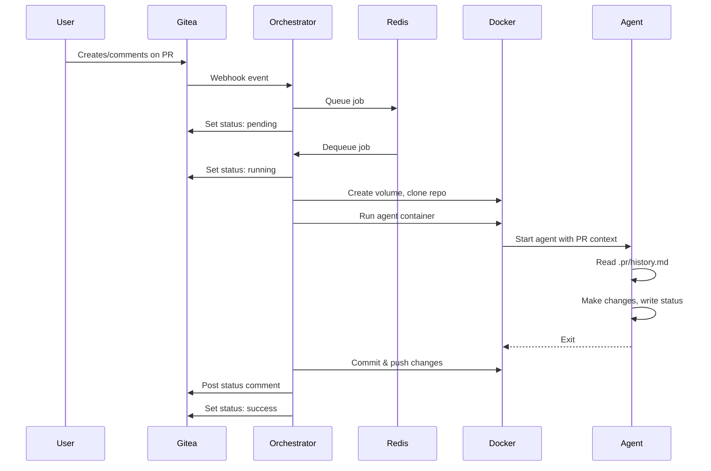

# Laforge: Pull Request-Based Coding Agent

Laforge is a self-hosted agent orchestrator that enables AI coding agents to collaborate on pull requests. When triggered via Gitea webhooks, Laforge spawns Docker containers running coding agents (like Claude Code) that can read PR context, make code changes, and post status updates for human review.

## How It Works



## Features

- **Multiple Models**: Configure different AI models (Claude Sonnet, Opus, Haiku, or GPT via LMStudio)
- **Slash Commands**: Trigger agents with `/implement`, `/plan`, `/critique`, or `/cleanup`
- **Collaborative Workflow**: Agents propose changes via `status.yaml`, humans review and respond
- **Automatic Git Operations**: Changes are committed and pushed automatically
- **NTFY Notifications**: Get notified when agent runs complete or fail
- **Distributed Processing**: Redis-backed job queue with configurable concurrency

## Architecture

Laforge consists of:

| Component | Description |
|-----------|-------------|
| **Orchestrator** | Go service that receives webhooks, queues jobs, and manages agent containers |
| **Redis** | Job queue (via [Asynq](https://github.com/hibiken/asynq)) and PR locking |
| **Agent Containers** | Docker containers running coding agents (e.g., Claude Code) |
| **Gitea** | Self-hosted Git service (GitHub-compatible) |
| **NTFY** | Push notification service |

## Triggering Agents

Agents are activated when:
1. The bot user (default: `laforge`) is assigned to a PR, OR
2. A comment contains a slash command

### Slash Commands

| Command | Description |
|---------|-------------|
| `/implement sonnet` | Run implementation with Claude Sonnet |
| `/plan opus` | Run planning mode with Claude Opus |
| `/critique haiku` | Run code critique with Claude Haiku |
| `/cleanup` | Remove `.pr` directory and prepare PR for merge |

The model name is optional; defaults are configured in `laforge-config.yaml`.

### Webhook Events

The orchestrator responds to:
- `pull_request`: opened, reopened, assigned, edited
- `issue_comment`: created, edited (on PRs only)
- `pull_request_review`: submitted
- `pull_request_review_comment`: created, edited

Events from the bot user are automatically ignored to prevent infinite loops.

## Agent Workflow

When an agent runs, it:

1. **Reads context** from `.pr/history.md` (PR description and comments)
2. **Makes changes** to the codebase as needed
3. **Writes status** to `.pr/status.yaml` for human review
4. **Writes commit message** to `.pr/commit.md`

The orchestrator then:
- Commits and pushes changes to the PR branch
- Posts the status as a PR comment
- Updates the Gitea commit status

### The `.pr` Directory

This special directory is used for agent-human communication:

| File | Purpose |
|------|---------|
| `.pr/history.md` | PR description and comment history (auto-generated) |
| `.pr/plan.md` | Agent's task breakdown and progress |
| `.pr/status.yaml` | Status update to post as PR comment |
| `.pr/commit.md` | Commit message for changes |
| `.pr/attachments/` | Downloaded images and files from PR comments |

The `.pr` directory is removed when `/cleanup` is run before merging.

## Quick Start

1. Clone this repository
2. Copy `laforge-config.example.yaml` to `laforge-config.yaml` and configure
3. Start services: `docker-compose up -d`
4. Configure Gitea webhook (see [SETUP.md](SETUP.md))
5. Assign the bot user to a PR or use a slash command

## Configuration

See `laforge-config.example.yaml` for all configuration options:

```yaml
server:
  port: "8080"
  webhook_secret: ""  # Optional: validate webhook signatures

redis:
  address: "redis:6379"

gitea:
  url: "http://gitea:3000"
  token: ""  # Required: API token for status updates

worker:
  concurrency: 5

bot:
  username: "laforge"
  email: "laforge@example.com"

models:
  sonnet:
    model_id: "claude-sonnet-4-5-20250929"
    image: "laforge/claudecode"
  opus:
    model_id: "claude-opus-4-5-20251101"
    image: "laforge/claudecode"
  # ... more models

prompts:
  default_type: "implement"
  default_model: "sonnet"
```

## Documentation

- [SETUP.md](SETUP.md) - Detailed setup and webhook configuration
- [agents/AGENTS.md](agents/AGENTS.md) - Agent instructions and workflow
- [laforge-config.example.yaml](laforge-config.example.yaml) - Configuration reference
